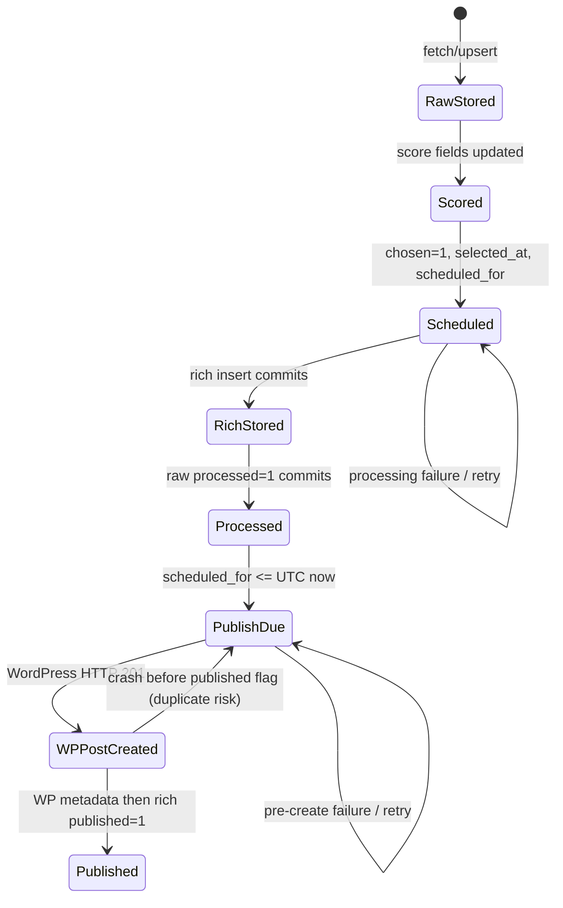
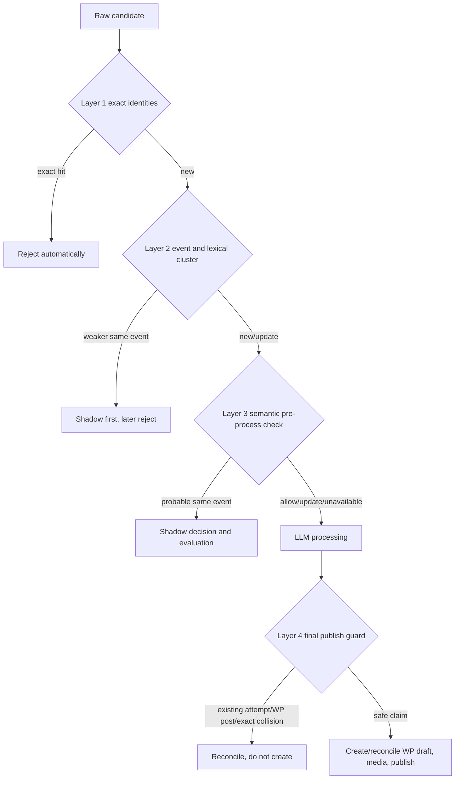

# GetNewsAPI System Architecture and Vector Roadmap

Audit date: 2026-07-26

Branch audited: `pipeline-throughput-hybrid-images`

Code baseline: `f0c2945 Add provider-neutral image search v2`

Operational evidence: `getnewsapi-20260726_085522.log.txt` (2026-07-25T19:19:02Z through an incomplete run beginning 2026-07-26T00:47:30Z)

Status labels used throughout this document:

- **CURRENT**: present and reachable in the audited code.
- **IMPLEMENTED BUT DISABLED**: present in code but not selected by the default configuration.
- **PLANNED**: recommended work; it does not exist yet.
- **OPTIONAL FUTURE**: useful later, but not required for the duplicate-defense objective.

Repository evidence is authoritative only for the checked-in code and schema artifacts. No database, WordPress, CryptoNews, or model-provider connection was made for this audit. The checked-in SQL dump is older than the runtime code, so any statement about a newer runtime column is an inference from SQL issued by the application, not a claim that the production schema was inspected.

## 1. Purpose and scope

**CURRENT**

GetNewsAPI fetches crypto-news candidates, stores and scores raw stories, selects a daily queue, rewrites due stories with hosted LLMs, stores rich articles, finds or generates a featured image, and creates published WordPress posts. The primary application tables are `cryptonewsapi` and the intentionally misspelled `rich_crpytonews`.

This document answers four operational questions:

1. What does the current system do, including its state transitions and failure behavior?
2. Which exact duplicate and idempotency controls exist at each stage?
3. Why can separate URLs covering the same event both be selected and published?
4. How should exact, event, lexical, semantic, topic, and publication defenses be introduced without making the main pipeline depend on embeddings?

It is an architecture and roadmap artifact only. No application behavior, environment setting, database schema, provider, model, route, or infrastructure was changed during this audit.

## 2. High-level system diagram

**CURRENT**


The current state path is keyed primarily by `news_url`, not by an immutable raw ID or provider event ID. The principal duplicate gap is between ingestion and publication: exact identities are checked only within a single pull or by URL uniqueness, while selection, processing, and publication do not compare event identity or semantic meaning.

## 3. Repository/module map

**CURRENT**

| Module or artifact | Responsibility | Important references |
|---|---|---|
| `GetNewsAPI/app.py` | Flask API; optional local scheduler startup | routes at lines 12-30 and 32-54; scheduler switch at 56-67 |
| `GetNewsAPI/config.py` | Environment parsing and provider/DB configuration | runtime controls 21-59; LLM routing 61-109; images 112-180; WP/DB 182-205 |
| `GetNewsAPI/db.py` | Application DB connection factory | lines 1-5 |
| `GetNewsAPI/fetcher.py` | CryptoNews pulls, in-memory exact dedupe, persistence, scoring, selection, scheduling | URL/title identities 164-207; pulls 429-552; persistence 734-800; selection 901-1081; cycle/lock 1146-1279 |
| `GetNewsAPI/gpt_processor.py` | Due-row selection, search enrichment, sticky LLM routing, rewrite, validation, rich persistence | due count 144-179; provider routing 481-943; search 1121-1198; rewrite 1203-1368; validation 1443-1643; persistence/process 1675-1981 |
| `GetNewsAPI/publish_to_wp.py` | Image routing, media upload, WP taxonomy/post creation, Yoast metadata, published state | publisher lock 184-223; due query 226-260 and 683-722; image switch 1250-1385; upload 1388-1548; publication 1642-1790 |
| `GetNewsAPI/scheduler.py` | Local APScheduler orchestration | independent process/publish error handling 27-69; 30-minute schedule 72-111 |
| `GetNewsAPI/tasks.py` | CLI entry points suitable for external cron | commands and chained behavior 16-83 |
| `GetNewsAPI/provider_smoke.py` | Prints routing configuration; optional live Grok calls behind explicit flags | flow 50-78; live gates 81-125; report 128-165 |
| `GetNewsAPI/stock_images.py` | V1 Pexels/Pixabay query, scoring, cache, reuse, and sequential selection | scoring 454-539; adapters 542-648; sequential selection 651-760 |
| `GetNewsAPI/image_search/*` | Provider-neutral V2 models, adapters, cache/retry, scoring, licensing, download validation, reuse, and selection | models 8-93; registry 15-41; selection 36-285 |
| `GetNewsAPI/tests/test_image_search.py` | Mocked image adapter, policy, ranking, reuse, routing, and attribution tests | transitive dedupe at 511; WordPress attribution flow at 972; V1 default routing at 1036 |
| `GetNewsAPI/crypto_news_db.sql` | Historical schema/data dump, not a current migration | generated for MariaDB 10.4 at lines 1-8; table definitions 30-44 and 70-84; URL unique keys 110-120 |
| `maintenance/sql/fresh_start_*.sql` | Manual queue inspection and cutoff cleanup | dry-run checks 5-149; apply transaction/default rollback 6-66 |
| `Dockerfile` | Python 3.11 image and application startup | lines 2-12 |
| `docker-compose.yml` | One Flask application service with bind mount | lines 1-17 |
| `.env.example` | Sanitized runtime/throughput/provider/DB setting inventory | lines 1-116 |

There is no migration framework, current schema snapshot, cron declaration, CI configuration, or prior architecture README in the audited repository. SQL conventions consist of one old dump and manually reviewed maintenance scripts, with the destructive fresh-start script defaulting to `ROLLBACK`.

## 4. Runtime and deployment modes

**CURRENT - Flask-only container**

`docker-compose.yml:1-17` builds one Python 3.11 service, maps host port 5001 to container port 5000, bind-mounts `GetNewsAPI` to `/app`, and runs `python app.py`. `.env.example:2` sets `ENABLE_APSCHEDULER=false`, so the example deployment serves Flask without background jobs unless explicitly overridden. There is no database service, health check, worker service, or cron service in the compose file.

**CURRENT - local APScheduler**

When `ENABLE_APSCHEDULER=true`, `app.py:56-67` starts the scheduler once with Flask reloading disabled. The fetch scheduler runs immediately and every 30 minutes with one in-process instance, coalescing, a 60-second misfire grace period, and jitter (`fetcher.py:1284-1315`). A separate scheduler runs processing and then publishing every 30 minutes, first after three minutes, with `max_instances=1`, coalescing, one-hour misfire grace, and jitter (`scheduler.py:72-111`). These controls prevent overlap only inside that Python scheduler instance.

**CURRENT - external cron entry points**

`tasks.py:16-83` exposes `fetch`, `process`, `publish`, and `chained`. `chained` attempts publication even when processing raises (`tasks.py:43-56`). No server cron expression is checked in, so its cadence, environment, timeout, and overlap policy cannot be audited from this repository. Fetch and publish have cross-process MariaDB advisory locks; processing does not.

**CURRENT - HTTP routes**

- `POST /api/publish` calls the publisher and returns success when the call returns (`app.py:12-30`).
- `GET /api/news` returns the seven newest rich rows without authentication or field filtering (`app.py:32-54`).

## 5. Environment configuration groups

**CURRENT**

| Group | Variables and defaults visible in code/example | Notes |
|---|---|---|
| Runtime | `ENABLE_APSCHEDULER=false`, `FLASK_DEBUG=false`, `PIPELINE_FRESH_START_AFTER_UTC` | parsed at `config.py:21-59` |
| Throughput | `DAILY_TARGET`, active window/share, max age, fetch pool/score limit, process min/max/lookahead, publish max | example at `.env.example:6-17`; module defaults differ from some example values |
| LLM | primary `grok`, fallback `openai`, provider keys/base URL/models/reasoning/output limits | `config.py:64-109` |
| Search enrichment | `GOOGLE_API_KEY`; search itself is a code constant `USE_WEB_SEARCH=1` | `gpt_processor.py:73-93` |
| Image mode | API/source flags, `hybrid`, `stock_first`, generated-image primary/fallback | `config.py:112-127` |
| Image search | default engine `v1`; V2 providers, dimensions, limits, license allowlist, retry/exhaustion behavior | `config.py:129-180` |
| WordPress | REST URL/user/application password and separate WP DB settings | `config.py:182-205` |
| Application DB | user/password/host/port/name; TLS verification is disabled in the connector dictionary | `config.py:187-196` |

Secrets are environment sourced and must remain absent from logs and documentation. The supplied log contains behavior and identifiers, not credentials.

## 6. Fetching and raw ingestion

**CURRENT - provider requests**

`fetcher._pull_batch()` performs three pulls (`fetcher.py:458-552`):

| Pull | Parameters relevant to identity |
|---|---|
| Rank-sorted multi-ticker | `extra-fields=id,eventid,rankscore` (`fetcher.py:487-495`) |
| General category | no `extra-fields` parameter (`fetcher.py:498-503`) |
| Multi-ticker | `extra-fields=id,eventid,rankscore` (`fetcher.py:505-511`) |
| Optional video | same extra fields, but `ALLOW_VIDEO=False` (`fetcher.py:513-523`) |

CryptoNews event ID is therefore explicitly requested on two active feeds and the optional video feed. The code reads `eventid` and writes it to `cryptonewsapi.event_id` (`fetcher.py:757-797`). The supplied log does not print payload identities, so it cannot prove that `eventid` was returned or populated. The general category request does not explicitly request it. Event ID is stored when returned but is never consulted by scoring, selection, processing, or publishing.

**CURRENT - pull-local exact dedupe**

Within one aggregated pull, the first candidate wins when any of these exact values was already seen (`fetcher.py:525-549`):

- non-empty `news_id`;
- `_clean_url(news_url)`;
- SHA-256 of the lowercased, outer-whitespace-trimmed title.

`_clean_url()` removes a limited tracker list, dangling separators, repeated slashes, and a trailing slash (`fetcher.py:164-190`). It does not fully canonicalize host casing, default ports, fragments, query ordering, arbitrary tracking keys, percent encoding, redirects, AMP variants, or publisher canonical tags. Title hashing does not normalize punctuation, Unicode, internal whitespace, or wording.

**CURRENT - persistence**

The retained pool is pre-ranked and truncated to `POOL_SIZE` before persistence (`fetcher.py:550-552`). `_insert_or_update()` inserts raw content and the news/event/rank/title identities, then uses `ON DUPLICATE KEY UPDATE` (`fetcher.py:734-800`). The repository schema declares only `news_url` unique (`crypto_news_db.sql:110-120`); it declares no unique provider news ID, canonical URL, title hash, event ID, or content hash. The live schema has additional columns because the runtime SQL uses them, but their indexes cannot be verified without a current schema artifact.

There is no body/content hash. `event_id` should not itself become an exact-rejection key because separate sources and legitimate updates may share an event. It is immediately useful as a cluster key and selection signal.

## 7. Scoring, selection and scheduling

**CURRENT - scoring**

The pre-blend uses API rank, recency, source prior, and ticker prior (`fetcher.py:209-237`). Up to the configured pool/score limit is sent to a hard-coded OpenAI `gpt-5-mini` scoring call, independent of primary rewrite-provider routing (`fetcher.py:637-732`). Recent unchosen rows receive a final weighted score from hosted-AI importance, rank, recency, source, and ticker values (`fetcher.py:828-880`).

**CURRENT - selection**

Breaking candidates above the threshold and within the four-hour comparison window are scheduled immediately (`fetcher.py:953-969`). Non-breaking candidates fill the remaining `DAILY_TARGET`, split across active/off-peak UTC windows, ordered by final importance and publication time (`fetcher.py:971-1048`). `_assign_schedule()` sets `chosen_for_publish=1`, `selected_at`, and `scheduled_for` (`fetcher.py:1052-1081`).

Selection does not compare candidates against:

- other candidates in the same event;
- already selected rows, except indirectly through `chosen_for_publish=0` on the candidate itself;
- processed or published stories with different URLs;
- source concentration;
- normalized title similarity;
- entity, number, or date overlap;
- rolling topic or angle quotas.

The daily counter counts selected rows, not successfully published posts (`fetcher.py:901-926`). Breaking stories are selected before remaining capacity is computed, so later breaking arrivals can raise the selected count above `DAILY_TARGET` (`fetcher.py:953-975`). The supplied log demonstrates a rise from 30 to 33.

## 8. LLM processing and sticky provider routing

**CURRENT**

Automatic batch size is the number due within the lookahead, clamped to `PROCESS_BATCH_MIN..PROCESS_BATCH_MAX` (`gpt_processor.py:144-179` and 1926-1931). Eligible rows are unprocessed, chosen, optionally within the fresh-start cutoff, and due within the lookahead; order is `scheduled_for`, then `selected_at` (`gpt_processor.py:1933-1964`). There is no processing advisory lock or transactional row claim.

For each row (`gpt_processor.py:1848-1895`):

1. Gemini search grounding requests up to three recent facts when the code constant is enabled (`gpt_processor.py:1121-1198`).
2. The rewrite tries the configured primary LLM and then the configured fallback (`gpt_processor.py:876-921`). Defaults are Grok then OpenAI (`config.py:65-70`, `config.py:105-109`).
3. The provider that produced the valid rewrite becomes sticky for repair (`gpt_processor.py:1353-1368`, `gpt_processor.py:1532-1625`). A short body may first receive same-provider expansion (`gpt_processor.py:747-811`).
4. On failure, the row remains `processed=0` and is retryable (`gpt_processor.py:1888-1895`).

Provider HTTP calls use bounded retry/backoff. Grok retries up to seven times with jitter (`gpt_processor.py:591-669`); OpenAI handles network/transient statuses and malformed/truncated output (`gpt_processor.py:947-1115`); Gemini retries only 429/503 (`gpt_processor.py:1159-1172`).

## 9. Hard and soft article validation

**CURRENT**

Hard validation requires title, body, category, hashtags, sentiment, SEO focus/slug/meta, image alt, at least one paragraph, and at least 450 plain-text words (`gpt_processor.py:1795-1846`). The prompt asks for 550-750 words, at least two H2 headings, restricted source links, and specific SEO placement (`gpt_processor.py:1251-1321`).

Readability and Yoast-style checks are calculated separately (`gpt_processor.py:1443-1513`). Soft failures include sentence length, transitions, keyword placement/density, metadata/title length, H2 count, external links, and target length (`gpt_processor.py:363-397`). A hard-valid article is stored even when soft checks remain after repair, with a warning (`gpt_processor.py:1624-1643`).

The prompt examples repeatedly use `bitcoin dominance` as the SEO-focus example (`gpt_processor.py:1236-1248`, `gpt_processor.py:1307-1320`). The operational log also shows source article 14744, titled about one million congressional contacts and the CLARITY Act, receiving `seo_focus='bitcoin dominance'`. This is evidence that phrase repetition can be introduced or amplified by rewriting and SEO generation; it does not establish source-event duplication.

## 10. Rich article persistence

**CURRENT**

`store_rich_news()` normalizes one to three categories and inserts title/body, processing-time `publish_date`, source, categories, tags, sentiment, tickers, source image URL, and SEO fields (`gpt_processor.py:1675-1748`). It upserts by whatever unique key triggers, with the repository dump showing only unique `news_url`. On duplicate, only SEO focus/slug/meta are updated (`gpt_processor.py:1715-1745`).

Important persistence properties:

- There is no `raw_article_id` foreign key in the insert; raw and rich rows join by `news_url`.
- There is no check by raw ID, provider news ID, title, slug, event, or content similarity.
- Rich insertion commits before raw `processed=1` is committed through a separate connection (`gpt_processor.py:1745-1748`, `gpt_processor.py:1776-1793`, `gpt_processor.py:1883-1887`).
- A crash between those commits leaves a rich row with the raw row retryable. URL uniqueness prevents a second rich row for that same URL, but the expensive rewrite can repeat.
- Generated `schema_jsonld` and `image_alt` are not included in the rich INSERT (`gpt_processor.py:1717-1745`), even though later code tries to read `schema_jsonld` and media alt text. In the current path, media alt falls back to SEO focus/title (`publish_to_wp.py:1538-1544`).

No transaction guarantees "one raw row produces one rich row and becomes processed" as a single atomic state change.

## 11. Image Search V1

**CURRENT - default**

`IMAGE_SEARCH_ENGINE` defaults to `v1` in both code and `.env.example` (`config.py:129-131`; `.env.example:64-66`). In V1, article/SEO terms produce up to three queries, Pexels is searched first, then Pixabay only if needed (`stock_images.py:651-760`; `publish_to_wp.py:1250-1297`). Each provider uses its own minimum score and provider-specific API parameters (`stock_images.py:542-648`).

V1 behavior includes:

- a file cache with configurable hours (`stock_images.py:404-451`);
- local JSON usage and optional direct WordPress attachment-history reuse checks;
- sequential first-provider acceptance rather than one cross-provider ranking;
- threshold, dimensions, orientation, recent asset/source URL, and download conversion checks;
- generated-image fallback after stock failure in hybrid mode (`publish_to_wp.py:1467-1509`).

## 12. Image Search V2

**IMPLEMENTED BUT DISABLED**

V2 is selected only when `IMAGE_SEARCH_ENGINE=v2` (`publish_to_wp.py:1356-1361`). It provides a common `ImageCandidate` contract with source, creator, license, dimensions, score, URL/content hashes, and attribution (`image_search/models.py:8-69`). The registry can enable Pexels, Pixabay, and Openverse (`image_search/registry.py:15-41`).

V2 behavior includes:

- concurrent provider collection, with deterministic ranking after all completions (`image_search/selection.py:144-227`);
- provider threshold normalization for cross-provider ranking (`image_search/scoring.py:102-124`);
- strict configured-license and attribution checks (`image_search/license_policy.py:36-61`);
- connected-component identity dedupe across asset key, canonical source, source page, and URL hash, retaining the highest-ranked member (`image_search/selection.py:73-80`, `image_search/selection.py:103-141`);
- exact downloaded-content and perceptual-image duplicate checks (`image_search/selection.py:93-100`, `image_search/selection.py:228-258`);
- provider failure isolation and a distinction between "all exhausted" and "provider unavailable" (`image_search/selection.py:165-186`, `image_search/selection.py:275-285`);
- generation only after confirmed search exhaustion by default (`publish_to_wp.py:1369-1385`).

Openverse requests CC0, PDM, and CC BY works and normalizes work title, creator, source page, license/version/URL, and complete attribution (`image_search/providers/openverse.py:111-205`). Tests cover provider adapters, license rejection, completion-order independence, transitive dedupe, reuse, provider failure, V1/V2 routing, and full Openverse attribution through `upload_image()` to the mocked WordPress media payload (`tests/test_image_search.py:207-1037`).

## 13. Image reuse, licensing and attribution

**CURRENT**

Stock reuse is tracked in a local JSON file and checked for a configurable rolling window. V2-compatible usage records include provider asset/canonical/source identities, URL/content/perceptual hashes, creator/license attribution, post ID, title, and time (`image_search/reuse.py:86-121`). That common recorder is called after a successful post for stock images in either engine (`publish_to_wp.py:1759-1763`). Consequently, a V1 run can emit `[IMG-V2] recorded image usage`; the prefix does not prove that V2 search ran.

V1 checks local usage and recent WordPress attachments. V2 adds canonical identity and downloaded-content/perceptual matching (`image_search/reuse.py:124-173`). WP-history failure is fail-open to local usage (`image_search/reuse.py:190-209`). Local file updates have no cross-process lock, so two publishers on different deployments could race even though one database advisory lock protects publishers sharing the same DB.

`upload_image()` sends selected credit/attribution text to WordPress media caption and description after upload (`publish_to_wp.py:1526-1545`). Media metadata failure is caught and does not block post publication (`publish_to_wp.py:1551-1566`). Therefore complete attribution is constructed and sent in V2, but runtime persistence is best effort rather than a publication gate.

## 14. WordPress publishing

**CURRENT**

The publisher takes the `wp_publisher_lock` advisory lock (`publish_to_wp.py:1642-1690`), counts due rich rows, and fetches up to `PUBLISH_BATCH_MAX` rows where the joined raw row is chosen, scheduled, due, and within any fresh-start cutoff (`publish_to_wp.py:226-260`, `publish_to_wp.py:683-722`, `publish_to_wp.py:1691-1704`).

For each row it:

1. selects/generates and uploads media before creating the post;
2. ensures categories and tags through WordPress REST;
3. modifies article HTML with market/category links;
4. posts immediately with title, content, slug, current `date_gmt`, terms, and optional featured media (`publish_to_wp.py:1709-1754`);
5. on HTTP 201, records stock-image usage, writes Yoast values directly to the WordPress DB, then sets `rich_crpytonews.published=1` (`publish_to_wp.py:1754-1775`).

Media upload has transient HTTP retries (`publish_to_wp.py:1049-1087`); post creation uses one direct `session.post`. The publisher does not query WordPress by raw ID, rich ID, source URL, exact title, slug, or idempotency key. It does not persist `wp_post_id` in the application DB.

**Critical idempotency gap:** after WordPress creates a post, any lost response, process crash, image-usage failure, WP DB metadata failure, or app-DB update failure can leave `rich_crpytonews.published=0`. The next run will create another post because no durable post ID or reconciliation key exists. The advisory lock prevents simultaneous publisher runs; it does not make one publication attempt crash-idempotent. An error before post creation can also leave orphaned media.

## 15. Database tables and state transitions

**CURRENT - schema evidence limitation**

The checked-in dump was generated against MariaDB 10.4 in April 2025 (`crypto_news_db.sql:1-8`). It lists only basic columns plus a unique `news_url` on each table (`crypto_news_db.sql:30-44`, `crypto_news_db.sql:70-84`, `crypto_news_db.sql:110-120`). Runtime SQL proves that the deployed schema must contain additional columns, but no current DDL or migration history is in the repository.

**Runtime columns inferred from code**

| Table | Key runtime fields used by code |
|---|---|
| `cryptonewsapi` | `id`, `news_url`, `canonical_url`, `title`, `full_text`, `publish_date`, source/topics/tickers/image, `news_id`, `event_id`, `rank_score`, `title_hash`, `fetch_batch_id`, `gpt_importance`, `is_breaking`, `recency_score`, `source_weight`, `final_importance`, `chosen_for_publish`, `selected_at`, `scheduled_for`, `processed`, `insertDate` |
| `rich_crpytonews` | `id`, `news_url`, title/body, processing-time `publish_date`, source/category/hashtags/sentiment/tickers/image, `seo_focus`, `seo_slug`, `seo_meta`, `published`, `insertDate`; code may read `schema_jsonld` but does not write it |



The rich/raw relationship is a URL join, not a declared foreign key in the repository artifact. Published WordPress identity is not represented in the app schema.

## 16. Scheduler, cron and advisory locks

**CURRENT**

| Stage | In-process overlap control | Cross-process control | Scope/gap |
|---|---|---|---|
| Fetch | APScheduler `max_instances=1` | MariaDB `news_fetcher_lock` | robust while lock connection lives (`fetcher.py:1146-1279`) |
| Process | chained scheduler `max_instances=1` only | none | external cron/manual calls can select the same rows concurrently |
| Publish | chained scheduler `max_instances=1` | MariaDB `wp_publisher_lock` | prevents overlap, not post-create crash duplicates (`publish_to_wp.py:1671-1790`) |

Both local and CLI chained modes isolate processing failure from publishing (`scheduler.py:46-69`; `tasks.py:43-56`). This is intentional backlog-draining behavior. No checked-in server cron definition proves whether APScheduler and cron are mutually exclusive in deployment; operators must ensure only one orchestration mode is enabled.

## 17. Failure handling and retries

**CURRENT**

| Failure | Current outcome |
|---|---|
| CryptoNews request error/non-200 | short diagnostic, empty pull fragment; cycle continues with other pulls (`fetcher.py:429-456`) |
| Fetch cycle exception | logged; lock released in `finally`; task may appear completed because exception is swallowed (`fetcher.py:1244-1279`) |
| Scoring failure | whole fetch cycle exception path; raw upserts may already be committed |
| Gemini/Grok/OpenAI transient error | bounded retries; article-level provider fallback for rewrite |
| Hard-invalid article | expansion/repair/fallback; remains retryable if all fail |
| Soft SEO failure | warning; article is stored |
| Rich commit succeeds, processed update fails | rich exists; raw remains retryable; rewrite may repeat |
| Image search/generation failure | post can proceed without featured image |
| Media metadata failure | swallowed; post proceeds, attribution may be missing |
| WP post non-201 | row remains unpublished; uploaded media can be orphaned |
| WP post created, later step fails | row can remain unpublished and create a duplicate on retry |

**CURRENT - fresh-start and backlog**

The fresh-start cutoff is applied to process due-count/selection (`gpt_processor.py:161-176`, `gpt_processor.py:1933-1962`) and publisher due/fetch queries through joined raw `insertDate` (`publish_to_wp.py:226-260`, `publish_to_wp.py:701-717`). Fetch and scoring do not apply it. Selection uses publication recency but does not filter `insertDate` by the cutoff (`fetcher.py:953-1048`). Thus a pre-cutoff row can theoretically consume a selected slot and then be refused by processing/publication.

The maintenance apply script clears queue fields on old, not-yet-published raw rows and deletes old unpublished rich rows, while preserving published rows and WordPress posts; it defaults to rollback (`maintenance/sql/fresh_start_apply.sql:35-66`). The dry-run's "publisher fallback" section (`fresh_start_dry_run.sql:134-149`) is stale: current `fetch_unpublished()` has no fallback after its primary query (`publish_to_wp.py:701-722`).

A rich row becomes publishable when its URL joins a chosen raw row whose schedule is due and whose rich `published` flag remains zero. It may have been prepared hours or days before the current process run, subject to cutoff. That is how publication can drain a rich backlog independently of current processing volume.

## 18. Current exact-duplicate protections

**CURRENT**

| Stage | Existing protection | Effective scope |
|---|---|---|
| Pull aggregation | exact `news_id`, cleaned URL, exact normalized-title hash | one `_pull_batch()` call only (`fetcher.py:525-549`) |
| Raw persistence | `ON DUPLICATE KEY UPDATE`; checked-in unique `news_url` | same stored source URL; other live unique keys unknown (`fetcher.py:757-797`; schema lines 110-120) |
| Scoring | candidate itself must remain unchosen for blended-score update | state guard, not duplicate detection (`fetcher.py:847-853`) |
| Selection | candidate must have `chosen_for_publish=0` | prevents reselection of one row; does not compare rows (`fetcher.py:955-963`, `fetcher.py:1031-1040`) |
| Processing | `processed=0` and `chosen=1`; rich URL upsert | retries one URL into one rich row; no process claim (`gpt_processor.py:1953-1964`, `gpt_processor.py:1717-1729`) |
| Publishing | rich `published=0`, joined due schedule, global advisory lock | prevents normal republish after app flag is set; not crash-idempotent (`publish_to_wp.py:683-722`, `publish_to_wp.py:1671-1775`) |
| Images | recent asset/source URL checks; V2 adds license, connected identities, SHA-256 and perceptual hash | image reuse only, not article duplicate defense |

No stage computes a normalized body hash or compares a new story to selected, processed, or published content by event or meaning.

## 19. Current same-event/semantic duplicate gaps

**CURRENT gaps**

1. `event_id` is requested and stored but not used, and is not explicitly requested on the category pull.
2. There is no provider-news-ID or canonical/content-hash unique constraint visible in repository DDL.
3. URL normalization is too narrow to represent a publisher canonical identity safely.
4. Multiple URLs for one event can all be scored and set `chosen_for_publish=1`.
5. Selection has no lookback across selected, processed, rich, or published rows and no topic/source quota.
6. LLM processing spends search/rewrite cost before any lexical, event, or semantic duplicate check.
7. Processing has no claim/lease, so overlapping cron/manual workers can process the same raw row.
8. Rich persistence has no raw-ID foreign key and is not atomic with `processed=1`.
9. Publication stores neither a WP post ID nor an idempotency key and does no WP reconciliation.
10. A post-success crash can create a second WordPress post on retry.
11. Logs do not connect fetch batch, raw ID, provider IDs, rich ID, source URL hash, decision, and WP ID in one record.
12. Repeated SEO focus and title framing can obscure whether repetition began in source selection or rewrite.

## 20. Findings from the attached production-style log

**CURRENT evidence**

The log begins inside a publisher run and ends inside a later processor run, so counts apply only to completed events visible in the supplied window.

| Observation | Audit result |
|---|---|
| WordPress posts | **Confirmed: 22** `Published WP post` events, IDs 5153 through 5195 (odd IDs) |
| Newly processed | **Confirmed: 10 completed attempts**, all successful: batches 5, 2, and 3; other completed runs attempted zero |
| Backlog drain | **Confirmed as the necessary explanation:** 22 posts minus 10 newly prepared rows means at least 12 posts came from rich rows prepared before the captured processing window |
| Daily selected | **Corrected:** reached 30, then 33 after additional breaking selection; reset at UTC midnight, then reached 4 |
| Semantic decisions | none logged; no `semantic`, `duplicate`, or same-event decision entries |
| Images | **Confirmed:** 12 Grok generated, 5 Pexels, 5 Pixabay; no OpenAI-generated publication image |
| Openverse | not visible |
| Search engine | V1 signatures are conclusive: `stock queries`, sequential Pexels/Pixabay messages, no V2 query/provider/ranking/license messages |
| `[IMG-V2]` | ten lines, all post-success stock usage recording; this shared recorder ran for the 5 Pexels and 5 Pixabay posts |

The ten processed raw IDs were 14559, 14561, 14608, 14598, 14508, 14626, 14590, 14712, 14744, and 14723. Their source-title failure context and SEO dumps correlate with the final ten publications (WP 5177-5195): the two ETF-flow stories, Dango, Digital X/Korbit, Mara, CLARITY odds, Iran de-escalation, Sberbank, congressional CLARITY contacts, and Fidelity. The first 12 visible publications therefore represent the prepared rich backlog in this window; this conclusion does not require assuming that any two titles are duplicates.

The 22 title/provider pairs, in publication order, were:

| WP ID | Image | Published title |
|---:|---|---|
| 5153 | Pexels | Bitcoin Dominance Reflects LTH Supply Peak |
| 5155 | Pexels | Bitcoin dominance: 3 takeaways from Strategy's credit plan |
| 5157 | Pixabay | XRP ETFs: 7 Facts Signal Institutional Shift and On-Chain Growth |
| 5159 | Pexels | Bitcoin policy focus: 5 key facets of State Dept push |
| 5161 | Grok | Bitcoin dominance: 5 key facts on the new US 'freedom tech' push |
| 5163 | Pexels | Ethereum price odds: 6 takeaways from Polymarket |
| 5165 | Grok | CLARITY Act Ethics Rules Draw Fresh Scrutiny |
| 5167 | Grok | Ripple acquisitions: 5 key audit takeaways |
| 5169 | Grok | Prediction markets: 5 trends as regulatory heat rises |
| 5171 | Pixabay | Sberbank crypto trading: 7 key details by 2026 |
| 5173 | Grok | Bitcoin Dominance Shaped by Samsung Stablecoin News |
| 5175 | Pixabay | Digital Asset Market Clarity Act gains FOP backing |
| 5177 | Grok | Bitcoin dominance in ETF flows: 3 setbacks mark 2026 H1 downturn |
| 5179 | Grok | Bitcoin Dominance Steady Despite ETF Volume Drop |
| 5181 | Grok | CLARITY Act prospects: 30% odds and 4-day Senate deadline |
| 5183 | Pixabay | Dango Shutdown Halts Trading July 29 |
| 5185 | Grok | Bitcoin Dominance Holds on Iran De-escalation |
| 5187 | Grok | Digital X Rebrands Korbit After $102M Deal |
| 5189 | Pexels | Mara Bitcoin Mining Deal Draws Lawsuit Claims |
| 5191 | Pixabay | Sberbank crypto trading plans: 3 key thresholds |
| 5193 | Grok | CLARITY Act: 5 key updates as bitcoin dominance shapes debate |
| 5195 | Grok | CLARITY Act: Fidelity backs Senate push in 2026 |

### Suspicious groups and evidence classification

Title similarity alone is not proof. The log supports the following triage, not final duplicate decisions:

| Pair/group | Log-supported classification | Why / what is missing |
|---|---|---|
| State Dept push vs US "freedom tech" push (WP 5159/5161) | **Probable same-event candidate** | published together with unusually similar policy-push framing; no raw IDs, URLs, bodies, or event IDs are logged |
| Two ETF-flow Bitcoin-dominance posts (WP 5177/5179; processed raw IDs 14559/14561) | **Probable same-event candidate or legitimate update** | distinct raw IDs; one log excerpt cites H1/June/July flows and the other low ETF volume/Ether inflows; URLs, timestamps, bodies, event IDs, and fact deltas are needed |
| Two Sberbank crypto-trading posts (WP 5171/5191; second raw ID 14712) | **Probable same-event candidate** | same distinctive bank/action/2026 launch framing within 2.5 hours; first raw identity and both source records are absent |
| CLARITY congressional-contact story raw 14744 vs Fidelity coalition story raw 14723 (WP 5193/5195) | **Broad topical overlap with a related legislative event; likely distinct factual triggers** | source titles in failure logs identify one-million contacts versus Fidelity joining a coalition; source URLs/bodies and event IDs are still needed |
| Ethics scrutiny, FOP backing, 30% odds/deadline, contacts, and Fidelity CLARITY coverage | **Same legislative topic; insufficient evidence to call exact duplicates** | titles suggest different actors, facts, and updates; event clustering should connect them while update classification decides what is publishable |
| LTH supply, Strategy credit, Samsung stablecoin, ETF flows, Iran de-escalation under "Bitcoin dominance" | **Broad topical overlap only on the log evidence** | distinct named drivers; the rewrite prompt and SEO output can add "bitcoin dominance" even when the source title did not contain it |

No pair can be classified as an **exact duplicate** from this log. Proving or rejecting that requires a joined inspection of raw ID, provider news ID, provider event ID, source URL, canonical URL, raw title/body, source publication timestamp, rich ID, WordPress ID, normalized content hash, and (for semantic triage) embedding similarity. None of that inspection was performed in this audit.

### Required publication logging

**PLANNED**

Emit one structured record per state transition, without full article bodies:

```json
{
  "event": "publication.succeeded",
  "run_id": "uuid",
  "fetch_batch_id": "opaque-id",
  "raw_article_id": 14712,
  "rich_article_id": 12345,
  "provider_news_id_hash": "sha256:...",
  "provider_event_id_hash": "sha256:...",
  "source_url_hash": "sha256:...",
  "canonical_url_hash": "sha256:...",
  "content_hash": "sha256:...",
  "title": "Sberbank crypto trading plans: 3 key thresholds",
  "source_published_at": "2026-07-25T00:00:00Z",
  "scheduled_for": "2026-07-25T23:17:17Z",
  "duplicate_mode": "shadow",
  "duplicate_decision": "allow_update",
  "matched_document_id": 456,
  "wp_post_id": 5191,
  "image_provider": "pixabay"
}
```

Provider IDs and URLs can be logged as hashes when operations do not need the clear value. Titles are already logged; bodies and embedding vectors must not be logged.

## 21. Duplicate terminology and policy

**PLANNED**

| Category | Definition | Initial action |
|---|---|---|
| Exact duplicate | same provider news ID, trusted canonical source URL, or normalized body/content hash | reject automatically using deterministic constraints; no vector threshold required |
| Same-event duplicate | separate sources/titles reporting substantially the same facts and event state | cluster and keep the strongest candidate; semantic enforcement starts only after shadow evaluation |
| Legitimate update | same event but materially new decisions, outcomes, numbers, participants, or timestamps | allow, link to prior coverage, record `relationship=update`, and require a non-repetitive angle |
| Broad topical overlap | same topic/entity but a different event | allow, subject to topic/entity frequency and angle-diversity policy |

Event ID is a clustering signal, not automatically an exact-duplicate key. Vector similarity is also a signal, not a complete policy. Exact, event, update, and topic decisions require different evidence combinations and thresholds.

## 22. Recommended layered duplicate architecture

**PLANNED**



### Layer 1: ingestion exact checks

**PLANNED - enforce from first rollout after backfill validation**

- Store provider name plus provider news ID and enforce a scoped unique hash.
- Replace the regex-only URL identity with parser-based normalization and store both source URL and canonical URL SHA-256 values.
- Compute a normalized source-content hash after stripping boilerplate and normalizing Unicode/whitespace.
- Add unique constraints only after a collision report and deterministic survivor/backfill policy.
- Treat event ID as a non-unique cluster key.
- Preserve the rejected candidate and reason in an audit table or compact identity history rather than silently discarding all provenance.

### Layer 2: pre-selection event checks

**PLANNED - shadow, then enforce deterministic high-confidence cases**

Compare the candidate with recently selected, processed, and published rows using event ID, normalized-title token similarity, named entities, important numbers/dates, publication-time proximity, and source quality. Event clusters retain all source members but assign one primary candidate. An event-ID match alone clusters; it blocks only when corroborating facts indicate no new information.

### Layer 3: pre-processing semantic check

**PLANNED - shadow first**

Run before Gemini/rewrite cost. Query recent raw title/summary vectors first, then inspect lexical/entity/number evidence and any existing event cluster. Compare against recently selected raw stories, rich processed stories, and WordPress-linked published documents. If embeddings are missing or the hosted embedding API is unavailable, fail open to existing exact/lexical controls, enqueue retry, and continue the main pipeline.

### Layer 4: final pre-publish guard

**PLANNED - enforce deterministic idempotency immediately; semantic guard shadow first**

- Atomically claim one rich row with a lease/state transition.
- Use an application `publication_attempts` row with unique raw ID, rich ID, and deterministic idempotency key.
- Reconcile any saved WP ID before media generation.
- Query WordPress for deterministic post meta/source identity or a reserved draft when a previous response may have been lost.
- Create/reconcile a draft first, persist `wp_post_id`, then upload media and update the draft to published status.
- Recheck exact/event decisions immediately before external creation so a newly published competing worker is visible.
- Block exact identity/WP collisions automatically. Keep semantic same-event decisions in shadow until measured precision is high.

### Immediate non-vector priorities

1. Current schema snapshot and collision report.
2. Durable publication idempotency, WP ID persistence, reconciliation, and processor claims.
3. Provider ID/canonical URL/content hashes with validated unique constraints.
4. Event ID requested on every relevant CryptoNews pull, indexed, logged, and clustered in shadow mode.
5. Lexical/entity/number/date same-event assessments before selection and processing.
6. Structured stage logs and a labeled duplicate-evaluation set.
7. Topic/entity rolling quotas and an explicit breaking override; do not lower `DAILY_TARGET` as a substitute.

### Topic saturation and angle diversity

**PLANNED - independent controls, shadow first**

- **Exact duplicate:** deterministic rejection is independent of all topic quotas.
- **Same event:** default to one primary article per event; allow an additional article only when classified as a material update or an audited breaking override.
- **Same topic:** start by measuring, then shadow a configurable ceiling such as three articles per six-hour rolling window and eight per 24 hours. Tune by real topic volume and editorial review.
- **Same entity:** separately shadow a configurable ceiling such as four articles per six hours, because one entity can participate in several legitimate events.
- **Breaking override:** allow a documented bypass for material urgency, but require reason, actor/policy, event cluster, and later review. A breaking flag must not bypass exact identity or publication idempotency.
- **Angle novelty:** compare source fact signatures and proposed rich summary/outline to recent cluster/topic coverage. Low novelty should request a different angle or hold for review, not silently relabel the same facts.
- **Update classification:** require a material new-information signal such as a new decision, outcome, actor, number, date, filing, exploit state, or market response. Link allowed updates to the cluster primary and prior WP post.

Calculate topic/entity saturation from both raw source labels and generated SEO labels. Keeping those dimensions separate prevents a repeated LLM focus phrase from being mistaken for repeated source selection. These controls address concentration while preserving the configured daily throughput target.

## 23. MariaDB vector architecture

**PLANNED**

MariaDB 11.8 native `VECTOR` is the recommended store, conditional on a deployment preflight proving the actual server is 11.8 and supports the intended distance/index syntax. The repository's old 10.4 dump is not a production-version check, and compose does not declare a DB server.

At approximately 30 posts/day and 4-6 vectors/article, the mathematical range is about 43,800-65,700 vectors/year and the five-vector midpoint is 54,750. Allowing for summaries or occasional extra chunks makes 50,000-70,000 vectors/year a sound planning envelope. This is modest enough for one MariaDB deployment and an approximate vector index, while retaining relational joins and transactionally consistent metadata.

### Connector capability audit

The current dependency is unpinned `mysql-connector-python` (`requirements.txt:3`) and all DB access uses `%s` parameters (`db.py:1-5`). These vector operations are server-side SQL:

| Capability | Recommended connector use | Audit conclusion |
|---|---|---|
| `VEC_FromText()` | `INSERT ... embedding = VEC_FromText(%s)` with a JSON-like vector string | expected to work through the current protocol without a Python vector adapter; integration test required |
| `VEC_ToText()` | select `VEC_ToText(embedding)` for diagnostics/backfill verification | avoids relying on native binary type decoding; integration test required |
| `VECTOR(N)` | execute version-checked DDL | server capability, not an ORM/connector feature |
| `VECTOR INDEX` | execute version-checked DDL and inspect query plans | server capability; exact MariaDB 11.8 syntax/options must be proven in a disposable integration environment |

Do not bind or decode raw binary vector values initially. Use `VEC_FromText()` and `VEC_ToText()` so the existing connector handles ordinary text parameters/results. Pin the connector version and run a disposable MariaDB 11.8 test covering DDL, insert, update, cosine query, index creation, `EXPLAIN`, backup, and restore before production migration.

One `VECTOR(N)` column has a fixed dimension. "Configurable dimensions" therefore means one active deployment/schema dimension at a time, validated against `EMBEDDING_DIMENSIONS`; a dimension change requires a side-by-side physical table/column and re-embedding migration, not mixed dimensions in one vector column.

## 24. Proposed schemas

**PLANNED - additive; names/types require a real 11.8 migration review**

### `vector_documents`

One logical source or generated document, independent of chunks:

- `id`, `raw_article_id`, `rich_article_id`, `wp_post_id`;
- `document_type`: `raw_source`, `rich_generated`, or `published_generated`;
- source name/URL/canonical URL and their hashes;
- provider news/event IDs plus provider scope;
- title, source/published timestamps, content hash;
- active embedding provider/model/dimensions/version and document status;
- `factual_provenance`: `primary_source`, `secondary_source`, or `coincourier_derivative`;
- created/updated timestamps.

Use nullable foreign identifiers but unique partial-equivalent keys through generated hashes or normal unique indexes appropriate to MariaDB. Never treat a CoinCourier derivative as independent factual confirmation of its source.

### `vector_chunks`

One active physical embedding dimension:

- `id`, `document_id`, `chunk_index`, `chunk_type`;
- `chunk_text`, `chunk_hash`;
- `embedding VECTOR(N)`;
- embedding provider/model/dimensions/version copied for audit;
- `metadata_json`, token count, created timestamp;
- unique `(document_id, chunk_index, embedding_version)`;
- relational index on `(document_id, chunk_type)` and a cosine `VECTOR INDEX` on `embedding`.

Keep chunk text for explainability and re-embedding only under source-retention policy. If source-content retention is restricted, retain a safe summary plus hashes and expire raw body chunks.

### `embedding_jobs`

- `id`, `document_id`, requested embedding version;
- `status`: queued/leased/succeeded/retry/dead;
- `attempt_count`, `lease_owner`, `lease_expires_at`, `next_attempt_at`, redacted `last_error`;
- created/updated timestamps;
- unique active job per document/version and indexes for claim order.

This stays separate from documents because retries/leases are many operational state transitions and should not overload document state.

### `duplicate_assessments`

- candidate raw ID, matched document/chunk/event cluster;
- exact match type, vector/lexical/entity/number/date/event signals;
- decision: exact reject, same-event reject, allow update, allow topic overlap, insufficient evidence;
- reason codes, policy/embedding versions, mode (`shadow`/`enforce`), actor, timestamp.

Keep this separate for evaluation, threshold changes, appeals, and false-positive analysis.

### `event_clusters` and `event_cluster_articles`

`event_clusters` stores cluster key, primary raw article, lifecycle, first/last seen, and optional canonical event summary. The member table stores raw article, relationship (`primary`, `duplicate`, `update`, `related`), similarities, new-information score, and decision time. These are separate because clusters are many-to-many over time and primary membership can change.

### `rag_retrieval_audit`

Stores article, retrieved document/chunk, similarity, rank, purpose (`duplicate`, `context`, `internal_link`, `angle`), policy version, and time. It can be deferred until retrieval features begin and pruned/partitioned because it will grow faster than documents.

### `publication_attempts` (non-vector but critical)

Add `id`, unique idempotency key/raw ID/rich ID, `wp_post_id`, deterministic WP slug/meta key, state, lease, attempt count, last error, and timestamps. This table should precede semantic enforcement because it closes the confirmed crash duplicate window.

The proposed tables should not be collapsed into the two article tables. Document/chunk, asynchronous job, decision audit, event membership, retrieval audit, and external publication have different cardinality, retention, and concurrency requirements.

## 25. Embedding and chunking strategy

**PLANNED**

### Initial hosted embedding configuration

- Provider: OpenAI, because the repository already has its SDK/key path and no local LLM is allowed.
- Initial model: `text-embedding-3-small`.
- Initial dimensions: 1536, deployment-configured and schema-validated.
- Version: explicit immutable value such as `openai:text-embedding-3-small:1536:source-normalization-v1`.
- Optional later quality experiment: a larger hosted embedding model, evaluated side by side rather than silently replacing vectors.

The provider/model recommendation must be revalidated against the approved provider catalog and data-retention terms at implementation time; this audit made no provider call.

### Document and chunk policy

| Document | Vector/chunk policy | Primary use |
|---|---|---|
| Raw source title + provider summary | one compact `raw_summary` vector, including entities/numbers/date | pre-selection and pre-processing duplicate search |
| Raw source body | heading/sentence-aware 450-700 token chunks, 60-100 token overlap, usually 3-5 | fact/event matching and historical source context |
| Rich title + concise summary | one `rich_summary` vector | angle comparison and internal links, not factual confirmation |
| Published body | heading-aware chunks, usually 3-5 | continuity, related coverage, internal links, repetitive-angle detection |

Normalize Unicode and whitespace; retain meaningful numbers, dates, tickers, and named entities. Do not remove negation. Hash the exact normalized chunk input. Keep raw-source and CoinCourier-generated namespaces separate in every query.

### Retention and re-embedding

- Keep published document metadata and vectors while posts remain live.
- Keep recent raw candidates long enough for duplicate/event windows; propose 90 days for rejected/unselected metadata and 12-24 months for source chunks, subject to provider/license policy.
- Keep hashes and cluster/audit decisions longer than source text when legally permitted.
- Re-embed side by side into a new dimension-compatible physical table/version, validate coverage and retrieval quality, switch reads, then retire the old version after rollback expiry.
- Backfill newest published/raw documents first, rate-limited and restartable by deterministic jobs.

### Async failure policy

Embedding jobs use short timeouts, exponential backoff with jitter, leases, maximum attempts, and dead-letter status. Fetch/process/publish enqueue or reconcile jobs but do not fail when embeddings are unavailable. A sweeper finds documents missing the active version. Semantic checks return `unavailable` and fail open to deterministic controls.

## 26. Retrieval use cases

**PLANNED**

1. **Semantic duplicate detection:** query recent raw summary vectors; rerank with event, lexical, entity, number/date, source, and time signals.
2. **Historical factual context:** retrieve raw-source chunks separately and label their source/time. Generated CoinCourier text can provide continuity but not corroboration.
3. **Internal-link suggestions:** retrieve published CoinCourier chunks, require live WP IDs/URLs and topical relevance, and avoid self-links.
4. **Repetitive-angle avoidance:** compare proposed rich summary/outline to recent published derivatives in the same event/topic, then prompt for genuinely new facts or framing.
5. **Update classification:** compare fact signatures and source chunks to determine whether a new article contains material changes.

Retrieval output must carry document type, source, source timestamp, WP ID, similarity, and reason. A vector result alone must never be presented as factual confirmation.

## 27. Shadow-mode rollout

**PLANNED**

Initial switches:

```text
VECTOR_ENABLED=false
VECTOR_DUPLICATE_MODE=off
EMBEDDING_PROVIDER=openai
EMBEDDING_MODEL=text-embedding-3-small
EMBEDDING_DIMENSIONS=1536
EMBEDDING_VERSION=openai:text-embedding-3-small:1536:source-normalization-v1
```

`VECTOR_DUPLICATE_MODE` supports `off|shadow|enforce`:

- `off`: schemas/jobs may exist, but no duplicate retrieval decision affects or logs candidate comparisons.
- `shadow`: generate/query vectors and persist assessments, but never reject or delay the article.
- `enforce`: only policy-approved, evaluated high-confidence decisions can block; embedding unavailability still fails open.

Rollout order is exact constraints/idempotency first, event and lexical shadow next, vector backfill, semantic shadow for several weeks, human labeling, then limited enforcement. Breaking-news overrides must be explicit and audited, not an unlogged bypass.

## 28. Metrics and evaluation

**PLANNED**

Build a labeled set containing exact duplicates, same-event duplicates, legitimate updates, and broad topical overlap. Include the suspicious log groups but label them only after source/DB inspection. Evaluate at pair and publication-decision level.

Track:

- exact collisions by identity type and source;
- candidates clustered, selected, rejected, overridden, and later published;
- duplicate precision/recall and false-positive rate by policy version;
- update recall and incorrect update suppression;
- topic/entity publications per rolling window;
- LLM calls/cost avoided before rewrite;
- embedding job latency, retry/dead rate, and active-version coverage;
- vector query latency and candidate count;
- publication claims recovered, reconciled WP posts, orphaned media, and duplicate WP incidents;
- operator review/override outcomes.

Initial similarity hypotheses, to be calibrated on real labels:

| Use | Starting hypothesis | Required corroboration/action |
|---|---|---|
| Exact duplicate | deterministic identity/hash, no vector threshold | enforce automatically after collision backfill |
| Probable same event | cosine >= 0.92 on raw summaries | require close time plus entity/event/number evidence; shadow first |
| Related context | cosine 0.78-0.92 | retrieval only; never block |
| Internal link | cosine >= 0.80 on published chunks | live WP target, editorial/topic checks |
| Repetitive angle | cosine >= 0.86 on rich summaries/outlines | same topic/event window; prompt/review before any blocking |

These values are hypotheses, not universal truths. Model version, text type, language, chunk type, and corpus distribution change score meaning. Event ID, lexical overlap, entities, numbers, dates, and new-information scoring must remain separate features.

## 29. Security and secret handling

**CURRENT and PLANNED**

- Continue sourcing credentials from environment variables (`config.py:18-205`); never persist them in docs, vector metadata, logs, or assessment reasons.
- Pin and scan dependencies before vector rollout; current requirements are unpinned.
- Redact provider tokens and credential-shaped strings from every error path, not only existing Grok/OpenAI helper errors (`gpt_processor.py:503-511`; `publish_to_wp.py:898-905`).
- Restrict `GET /api/news` or return an explicit public projection before treating Flask as internet-facing.
- Treat source chunks and embeddings as sensitive derived data. Approve hosted-provider retention/training terms and source-content licensing before backfill.
- Encrypt DB transport with certificate verification in production; current app DB config sets `ssl_verify_cert=False` (`config.py:187-196`).
- Log hashes and IDs rather than full URLs where practical, never full bodies or vectors.
- Limit WP application-password and direct-DB privileges. Publication reconciliation should need only the minimum post/meta access.

## 30. Deployment and migration roadmap

**PLANNED**

Each phase is intentionally deployable and reversible on its own.

### Phase 0: documentation and baseline measurements

- Files: this document, future log parser/metrics documentation.
- Migration: none.
- Tests: fixture-based parser against a redacted copy of the supplied log; baseline title-pair labeling format.
- Logs/metrics: current throughput, retries, backlog age, topic counts, duplicate incidents, post-create failures.
- Switch: none.
- Rollback: remove dashboards/parsers without runtime effect.
- Risk: low.

### Phase 1: exact dedupe and publication idempotency

- Files: likely `fetcher.py`, `gpt_processor.py`, `publish_to_wp.py`, `config.py`, DB helper/repository modules, and new focused tests.
- Migration: canonical/content/provider-ID hashes; current schema reconciliation; processing claim fields; `publication_attempts`; raw/rich/WP identity links and validated unique indexes.
- Tests: URL/content normalization, constraint collisions, concurrent process claims, lost WP response, crash after WP 201, WP reconciliation, orphan-media cleanup.
- Logs/metrics: exact reason, idempotency key, claim/reconcile states, raw/rich/WP IDs.
- Switch: `EXACT_DEDUPE_MODE=shadow|enforce`, `PUBLICATION_IDEMPOTENCY_ENABLED` defaulting on only after backfill.
- Rollback: disable exact enforcement while retaining identities; publication code reads legacy rows and existing `published` flag.
- Risk: medium-high because it touches external side-effect ordering; highest priority.

### Phase 2: CryptoNews event-ID ingestion and event clustering

- Files: `fetcher.py`, config, new clustering service/repository, tests.
- Migration: provider-scoped event ID index plus `event_clusters` and `event_cluster_articles`.
- Tests: every pull requests event ID, missing IDs, reused IDs, multiple sources per event, legitimate updates.
- Logs/metrics: event-ID coverage, cluster size, primary changes, source diversity.
- Switch: `EVENT_CLUSTER_MODE=off|shadow` initially.
- Rollback: stop cluster writes/reads; keep additive data.
- Risk: medium because provider event semantics/coverage are unverified.

### Phase 3: lexical/entity duplicate checks in shadow mode

- Files: new normalization/feature module; `fetcher.py` selection integration; processor preflight; tests.
- Migration: optional normalized-title/entity/fact-signature columns and assessment rows.
- Tests: punctuation/Unicode/title variants, entity and number/date deltas, update versus duplicate fixtures.
- Logs/metrics: component scores and shadow decision reasons, without bodies.
- Switch: `LEXICAL_DUPLICATE_MODE=off|shadow`.
- Rollback: switch off; no queue state changes in shadow.
- Risk: low-medium.

### Phase 4: MariaDB vector schema and asynchronous embedding jobs

- Files: config, vector repository, embedding client/worker/task, job sweeper, tests, requirements pin.
- Migration: `vector_documents`, dimension-specific `vector_chunks`, `embedding_jobs`, indexes; no enforcement.
- Tests: disposable MariaDB 11.8 DDL/functions/index/query plans, hosted client mocks, leasing/retries, dimension mismatch, backfill resume.
- Logs/metrics: coverage/version, queue latency, failures, query latency; no vector/body logs.
- Switch: `VECTOR_ENABLED=false` by default, then enable only job generation.
- Rollback: disable worker/read path; additive tables remain or are archived.
- Risk: medium.

### Phase 5: semantic duplicate shadow mode

- Files: semantic retrieval/reranking service; selection/processor preflight hooks; audit repository; tests.
- Migration: `duplicate_assessments`; possibly retrieval-audit table.
- Tests: labeled exact/event/update/topic corpus, missing embeddings, provider outage fail-open, model-version isolation.
- Logs/metrics: top match and all feature scores, policy version, shadow decision, human outcome.
- Switch: `VECTOR_DUPLICATE_MODE=shadow`.
- Rollback: `off`; no publication decisions were blocked.
- Risk: medium.

### Phase 6: enforce high-confidence duplicate blocking

- Files: policy engine, override/admin workflow, selection/processor integration, tests.
- Migration: decision/override metadata and cluster winner constraints if needed.
- Tests: false-positive regressions, breaking override, concurrent candidates, fail-open outage, appeal/requeue.
- Logs/metrics: block precision target, overrides, missed duplicates, update suppression.
- Switch: `VECTOR_DUPLICATE_MODE=enforce` for a narrow policy/version and cohort.
- Rollback: return to `shadow`; requeue blocked rows with preserved state.
- Risk: high; require measured precision and editorial sign-off.

### Phase 7: historical context and internal-link retrieval

- Files: retrieval service, prompt/context builder, link validator, publisher integration, tests.
- Migration: `rag_retrieval_audit`; published URL/status fields.
- Tests: source/generated provenance separation, stale/deleted WP targets, self-link and hallucinated-link prevention.
- Logs/metrics: accepted suggestions, click/quality review, retrieval provenance and latency.
- Switch: separate `RAG_CONTEXT_MODE` and `INTERNAL_LINK_MODE`, both shadow/suggest first.
- Rollback: disable context/link injection; articles continue without retrieval.
- Risk: medium.

### Phase 8: angle diversity and topic-saturation policy

- Files: topic/entity counters, angle classifier/policy, selection and rewrite integration, tests.
- Migration: optional topic assignments and rolling-decision audit; derive counters rather than storing mutable totals where practical.
- Tests: rolling windows, entity/topic distinction, breaking override, legitimate update, timezone boundaries.
- Logs/metrics: topic/entity frequency, angle novelty, overrides, diversity distribution.
- Switch: `TOPIC_SATURATION_MODE=off|shadow|enforce` and independent angle mode.
- Rollback: shadow/off; exact/event defenses remain.
- Risk: medium-high because editorial variety is policy-sensitive.

### Phase 9: database-backed image budgets and publisher crash recovery

- Files: image budget/reuse repository, publisher outbox/recovery worker, cleanup task, tests.
- Migration: image generation budget/usage and media/publication attempt state, including orphan tracking.
- Tests: multi-instance budget races, crash at every media/post/meta transition, stock attribution retry, orphan cleanup.
- Logs/metrics: daily provider budget, media/post reconciliation, orphan count/age, attribution completion.
- Switch: DB budget and recovery switches with local-file fallback during rollout.
- Rollback: disable budget/recovery workers; preserve publication idempotency and existing usage JSON compatibility.
- Risk: medium-high.

## 31. Testing strategy

**CURRENT**

The only checked-in test module is image-search focused. It has strong mocked coverage for V2 provider normalization, license policy, deterministic/transitive ranking, download/reuse behavior, generation gating, V1 rollback, and Openverse-to-WordPress attribution. There are no checked-in tests for fetch ingestion identities, selection duplication, process concurrency, rich transactions, fresh-start consistency, publisher idempotency, or backlog ordering.

**PLANNED**

- Unit-test URL/title/content normalization and policy feature extraction.
- Use table-driven duplicate fixtures for all four terminology categories.
- Add DB integration tests against disposable MariaDB 11.8, including unique collisions, transactions, advisory locks, claim leases, vector functions/indexes, and migrations.
- Add mocked CryptoNews payload tests with present/missing/reused `eventid`.
- Add processor tests proving a duplicate guard runs before Gemini/rewrite calls.
- Add WordPress contract tests for draft reservation, lost responses, existing-meta reconciliation, post ID persistence, media attribution, and publish retry.
- Add concurrency tests with two process/publish workers.
- Replay a redacted log fixture to validate counts and correlation fields.
- Build a human-labeled offline retrieval set and pin model/policy versions in expected results.
- Test every rollout switch in off, shadow, enforce, outage, and rollback modes.

No test should make a live provider, WordPress, or production DB call by default.

## 32. Rollback plan

**PLANNED**

1. Keep V1 image search as the default throughout duplicate/vector work.
2. Make all new schemas additive and old fields readable until the rollback window closes.
3. Separate exact/idempotency enforcement switches from event, lexical, vector, topic, RAG, and angle switches.
4. Roll semantic enforcement back to shadow without deleting assessments or vectors.
5. Preserve old embedding tables/version during side-by-side model/dimension rollout.
6. Requeue falsely blocked rows from explicit decision state; never reconstruct state from logs alone.
7. Retain deterministic publication attempts and WP IDs even if other new features are disabled; disabling idempotency after it owns posts would reintroduce duplicate risk.
8. Back up and verify restore before DDL; migration rollback must account for new rows created while dual-write is active.
9. Keep V1/V2 image usage fields mutually readable during image-budget migration (`image_search/reuse.py:86-121`).

## 33. Operational runbook

**CURRENT safe checks**

- Confirm exactly one orchestration mode: external cron or local APScheduler.
- Check `news_fetcher_lock` and `wp_publisher_lock` holders before diagnosing a skipped run.
- Compare selected-unprocessed, processed-without-published-rich, unpublished rich, and publish-ready counts using the reviewed dry-run queries; do not run the apply script without replacing the cutoff and changing its default rollback intentionally.
- Treat "processing succeeded" and "publishing succeeded" as stage summaries, not proof that every intended row was handled.
- For a suspected duplicate, collect raw/rich/WP IDs, provider news/event IDs, source/canonical URLs, source timestamps, content hashes, and decision records before deleting or unpublishing anything.
- For a post visible in WordPress but `published=0`, do not rerun publication blindly. Current code cannot reconcile it safely; inspect WP IDs/title/slug/source manually first.

**PLANNED vector/idempotency checks**

- Monitor active embedding version coverage and dead/retry jobs.
- Verify `VECTOR_ENABLED`, duplicate mode, policy version, and dimension/schema agreement at startup.
- Inspect exact identity and cluster evidence before overriding a decision.
- When embeddings are unavailable, confirm semantic checks show `unavailable/fail_open` while exact and publication-idempotency controls remain active.
- Reconcile stuck publication leases by deterministic idempotency key and WP post ID; never create a new post until reconciliation proves none exists.
- Audit media attribution completion for V2/Openverse and retry metadata separately from post creation.

## 34. Future improvements

**OPTIONAL FUTURE**

- A small editorial review UI for clusters, updates, overrides, and labeled examples.
- Source-quality calibration learned from corrections rather than static priors alone.
- Multilingual/cross-lingual duplicate evaluation if source languages expand.
- Claim-level fact extraction and contradiction detection for update classification.
- Time-decayed entity/event graphs for longer historical narratives.
- Automatic internal-link maintenance when WordPress slugs or post status change.
- Cluster-aware newsletter/homepage diversity and not only publication eligibility.
- A formal outbox for all external side effects, including taxonomy and media cleanup.
- OpenTelemetry traces and metrics with run/raw/rich/WP correlation IDs.
- A current generated schema snapshot and migration tool with CI-tested forward/rollback paths.

## 35. Open questions and decisions required

**PLANNED decisions**

1. What is the actual application DB server/version, and does production run MariaDB 11.8 with native vector support?
2. What is the complete current DDL and index set for both article tables?
3. How often is CryptoNews `eventid` populated, how stable is it across sources/updates, and is it scoped globally or by feed/provider?
4. Which canonical URL rules and source-content retention terms are approved?
5. Which suspicious log pairs are duplicates, updates, or merely related after source/DB review?
6. What false-positive ceiling and editorial override workflow are acceptable before semantic enforcement?
7. Should WordPress idempotency use a registered REST meta field/custom endpoint, direct DB reconciliation, or both?
8. Is draft-first post reservation acceptable operationally, and how long may stuck drafts/media remain?
9. Is OpenAI `text-embedding-3-small` approved for source text, and what provider data-retention policy applies?
10. Is 1536 the long-lived dimension, or should a quality/cost benchmark choose another dimension before DDL?
11. What rolling windows and caps apply independently to events, topics, entities, sources, and breaking news?
12. Should the hard-coded `bitcoin dominance` SEO examples be replaced with neutral/dynamic examples to reduce framing repetition?
13. Should generated `schema_jsonld` and `image_alt` be persisted, and must missing licensed-image attribution block publication?
14. Which external cron configuration is authoritative, and can all processing workers share a DB-backed claim protocol?
15. When should the stale schema dump and stale dry-run "publisher fallback" section be replaced with generated, versioned documentation?
